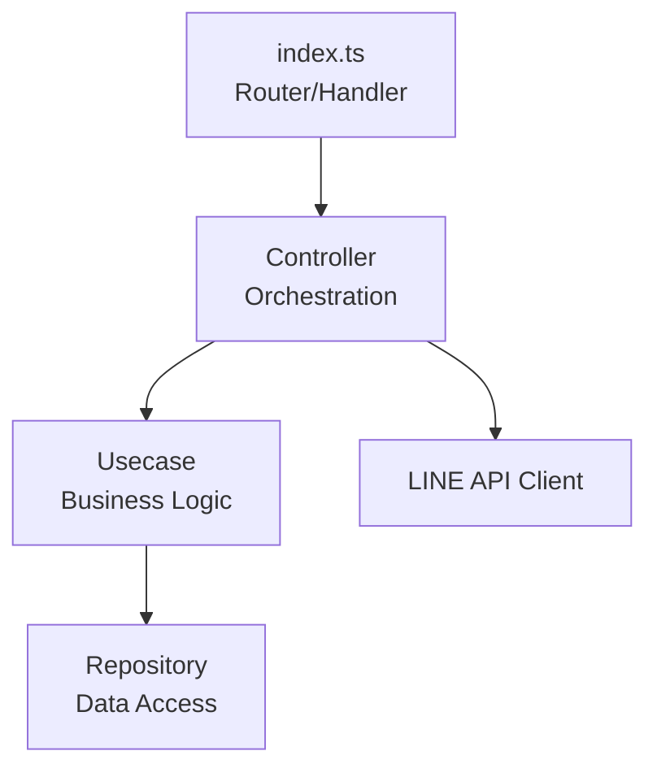

# LINE Reminder Bot - アーキテクチャドキュメント

## 概要

LINE Reminder Botは、Cloudflare Workers上で動作するリマインダーBotです。
このドキュメントでは、アプリケーションのアーキテクチャと技術的な決定事項を記録します。

## アーキテクチャ原則

| 原則               | 説明                                                                  |
| ------------------ | --------------------------------------------------------------------- |
| **関心の分離**     | 各層は明確な責務を持ち、他の層の実装詳細に依存しない                  |
| **テスタビリティ** | ビジネスロジックは外部APIやインフラストラクチャから独立してテスト可能 |
| **DDD**            | ドメイン駆動設計の原則に従い、ドメインモデルを中心に設計              |

## アーキテクチャ

| 層         | 責務                                                                                 |
| ---------- | ------------------------------------------------------------------------------------ |
| index.ts   | HTTPリクエスト/レスポンス、Webhook署名検証、ユーザー認証、イベント解析、ルーティング |
| Controller | イベントデータ変換、Usecase呼び出し、結果フォーマット、LINE API呼び出し              |
| Usecase    | ビジネスロジック、結果オブジェクトを返す、外部APIに依存しない                        |
| Repository | D1データベースアクセス、データ永続化・取得                                           |

### index.ts（Router/Handler層）

主にHTTPプロトコルの処理とセキュリティに関わる責務を持ちます。Webhook署名検証やユーザー認証、イベント解析など、リクエストの受け取りと初期処理を担当します。

**責務:**

- HTTPリクエストの受け取り
- Webhook設定の生成（環境変数から）
- Webhook署名検証（セキュリティ）
- ユーザー認証（全イベント共通）
- リクエストボディのパース（イベント解析）
- イベントタイプによるルーティング（text/postback/etc.）
- HTTPレスポンスの返却
- エラーハンドリング

**なぜこの責務を持つか:**

- **セキュリティは入口で**: Webhook署名検証・ユーザー認証はリクエストを受け取った最初の段階で行うべき。不正なリクエストを早期に弾くことで、後続の処理を保護する
- **認証の共通化**: ユーザー認証は全ハンドラーで必ず実行されるため、各Controllerに重複して記述するのではなく、ルーティング前に一元管理する
- **プロトコル処理の局所化**: HTTPプロトコルに関する知識（リクエスト/レスポンス、ヘッダー等）をこの層に閉じ込める。ビジネスロジックをHTTPから独立させる
- **ルーティングの責務**: どのイベントをどのハンドラーに渡すかの判断は、インフラ層の責務。ビジネスロジックではない
- **薄く保つ**: ドメイン知識（Vo作成）を持たせないことで、プラットフォームの変更（HTTPからgRPCへの移行等）に対して柔軟性を保つ

**やらないこと:**

- ビジネスロジックの実行
- データベースへの直接アクセス
- ドメインオブジェクト（Vo）の作成

### Controller（Orchestration層）

主にビジネスロジックのオーケストレーションとプレゼンテーションの責務を持ちます。イベントデータの変換やUsecaseの呼び出し、結果のフォーマットなどを担当します。

**責務:**

- イベントデータの変換（ドメインオブジェクト/Voの作成）
- 複数のUsecaseの組み合わせ
- Usecaseの実行結果を受け取る
- 結果をLINE形式にフォーマット
- LINE Messaging APIへのリクエスト送信

**なぜこの責務を持つか:**

- **ドメインオブジェクトの作成**: Voはドメインモデルの一部。プロトコル層（index.ts）にドメイン知識を持たせないため、この層で変換する
- **Usecaseの再利用性を保つ**: LINE APIへの依存をこの層に閉じ込めることで、Usecaseをプラットフォーム非依存に保つ。同じUsecaseをSlack、CLI、Web等で再利用可能にする
- **オーケストレーション**: 複数のUsecaseを組み合わせたり、Usecaseの実行順序を制御したりする責務。ビジネスフローの制御
- **プレゼンテーション層との橋渡し**: ドメインモデルの結果をLINE固有の形式（FlexMessage等）に変換する

**やらないこと:**

- ビジネスロジックの実装（それはUsecaseの責務）
- データベースへの直接アクセス（それはRepositoryの責務）
- HTTPリクエスト/レスポンスの直接処理（それはindex.tsの責務）
- ユーザー認証（それはindex.tsの責務）

### Usecase（Business Logic層）

主にビジネスロジックの実装とドメインルールの適用の責務を持ちます。外部APIやインフラストラクチャに依存せず、純粋な関数として設計されます。

**責務:**

- ビジネスロジックの実装
- ドメインルールの適用
- Repositoryを使ったデータの取得・保存
- 結果オブジェクトを返す

**なぜこの責務を持つか:**

- **ビジネスロジックの中心**: アプリケーションの核となるビジネスルール（「リマインダーをどう作成するか」「何時間後に通知するか」等）を実装する
- **テスタビリティ**: 外部API（LINE、Slack等）に依存しないことで、モックなしでユニットテストが可能。ビジネスロジックの正しさを高速に検証できる
- **再利用性**: プラットフォーム非依存なため、LINEだけでなく、Slack、CLI、Web UI等、あらゆるインターフェースから同じUsecaseを利用できる
- **純粋性**: 副作用（外部API呼び出し、HTTP通信等）を持たず、同じ入力に対して常に同じ結果を返す。予測可能で理解しやすいコード
- **結果を返すのみ**: プレゼンテーション（どう表示するか）はControllerの責務。Usecaseは「何が起きたか」の結果データのみを返す

**やらないこと:**

- LINE APIへの直接アクセス（プラットフォーム依存を避ける）
- HTTPリクエスト/レスポンスの処理（プロトコル知識を持たない）
- 結果のフォーマット（プレゼンテーション層の責務）

**重要な設計決定:**

- Usecaseは純粋な関数として設計され、外部APIに依存しません
- これにより、LINE APIをモックせずにユニットテストが可能です

### Repository（Data Access層）

主にデータベースアクセスの抽象化と永続化の責務を持ちます。D1データベースへのCRUD操作を担当し、Usecaseから呼び出されます。

**責務:**

- D1データベースへのCRUD操作
- クエリの実行
- データの永続化

**なぜこの責務を持つか:**

- **データアクセスの抽象化**: データベース固有の知識（SQL、D1 API等）をこの層に閉じ込める。Usecaseはデータの取得/保存の詳細を知る必要がない
- **データソースの変更容易性**: 将来、D1から別のデータベース（PostgreSQL、DynamoDB等）に変更する際、Repositoryのみを修正すればよい。Usecaseは影響を受けない
- **クエリの最適化**: データベース固有のパフォーマンス最適化（インデックス、クエリチューニング等）をこの層で行う
- **データの永続化のみに専念**: ビジネスロジック（「どのデータを保存するか」の判断）はUsecaseが行い、Repositoryは「どう保存するか」のみを担当

**やらないこと:**

- ビジネスロジックの実装（「何を保存するか」の判断はUsecaseの責務）
- データのフォーマット（プレゼンテーション層の責務）

## 環境変数

| 変数名                | 用途                                 | 場所             |
| --------------------- | ------------------------------------ | ---------------- |
| `LINE_CHANNEL_TOKEN`  | LINE Messaging APIのアクセストークン | `.dev.vars`      |
| `LINE_CHANNEL_SECRET` | Webhook署名検証用                    | `.dev.vars`      |
| `LINE_OWN_USER_ID`    | 認可されたユーザーID                 | `.dev.vars`      |
| `DB`                  | D1データベース                       | `wrangler.jsonc` |
