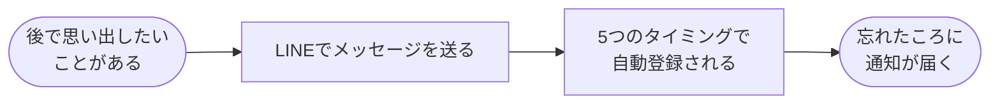
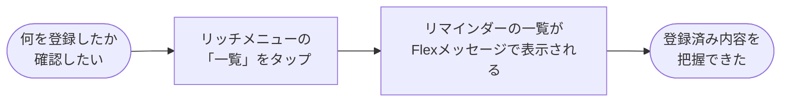
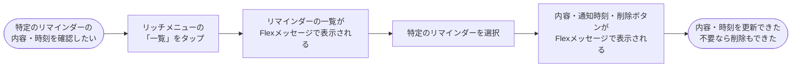
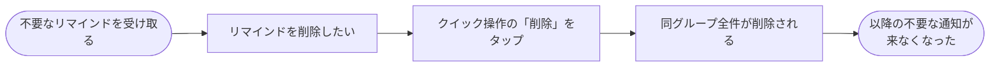
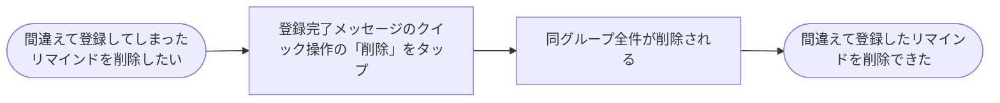

# ユーザーストーリー

## 一覧

| ストーリー | 関連する機能 |
| --- | --- |
| 後で思い出したいことをリマインド登録したい | [reminder-creation](./details/reminder-creation.md) |
| 登録したリマインダーの一覧を確認したい | [reminder-list](./details/reminder-list.md) |
| 特定のリマインダーを操作したい | [reminder-list](./details/reminder-list.md)  [reminder-update](./details/reminder-update.md), [reminder-delete](./details/reminder-delete.md) |
| 途中でいらなくなったリマインダーを削除したい/間違えて登録してしまったリマインドを削除したい | [reminder-delete](./details/reminder-delete.md) |

## 後で思い出したいことをリマインド登録したい

- **Who**: LINEユーザー
- **Do**: 後で思い出したいことをリマインド登録したい
- **Why**: 自分で覚えておかなくても、時間になったら気づけるようにしたいから
- **Note**: 通知時間はユーザーが指定しない。時間設定の手間を省き登録のハードルを下げるため、5分後・1日後・3日後・7日後・30日後の固定タイミングで自動登録する

## 登録したリマインダーの一覧を確認したい

- **Who**: LINEユーザー
- **Do**: 登録したリマインダーの一覧を確認したい
- **Why**: 何を登録しているか把握したいから
- **Note**: 一覧にはリマインドのテキストのみ表示し、詳細な内容は表示しない。一覧の視認性を保つため、詳細確認は別のストーリーで行う

## 特定のリマインダーを操作したい

- **Who**: LINEユーザー
- **Do**: 特定のリマインダーの操作をしたい
- **Why**: リマインド内容の更新や不要なリマインダーの削除をしたいから
- **Note**:
  - 削除 : 個別のリマインダーではなく、グループ単位で一括削除する。一部だけ残す操作は提供しない。
  - 更新 : 個別のリマインダーではなく、グループ単位で更新する。一部だけ残す操作は提供しない。メッセージの更新のみを提供し、時間の更新は提供しない。(時間の更新は複雑なUIになるため)

## 途中でいらなくなったリマインダーを削除したい/間違えて登録してしまったリマインドを削除したい

- **Who**: LINEユーザー
- **Do**: 途中でいらなくなったリマインダーを削除したい/間違えて登録してしまったリマインドを削除したい
- **Why**: 不要な通知を受け取り続けたくないから
- **Note**: 個別のリマインダーではなく、グループ単位で一括削除する。一部だけ残す操作は提供しない

